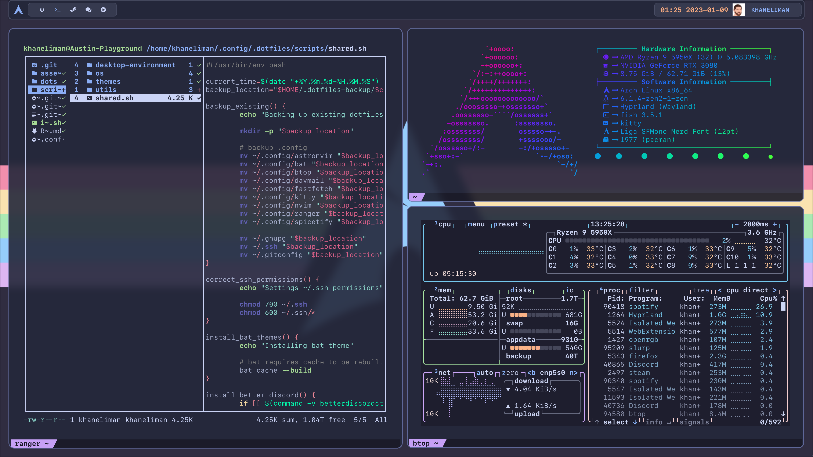
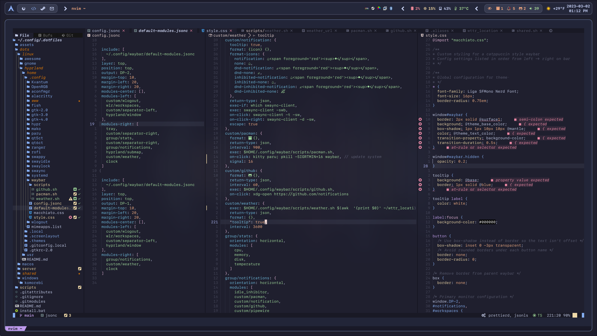
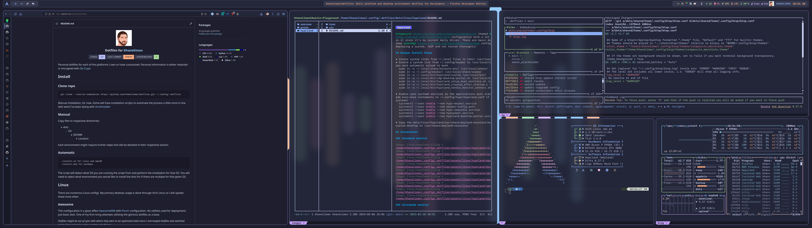
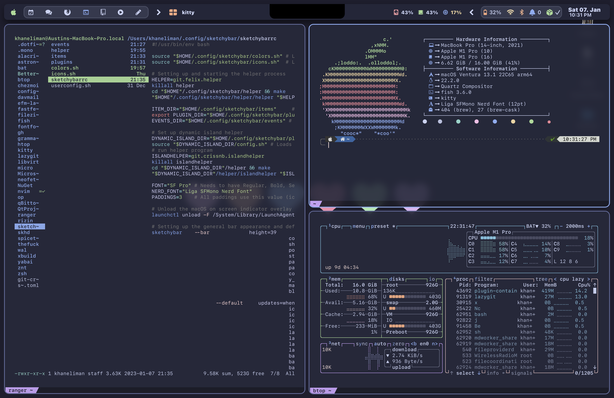
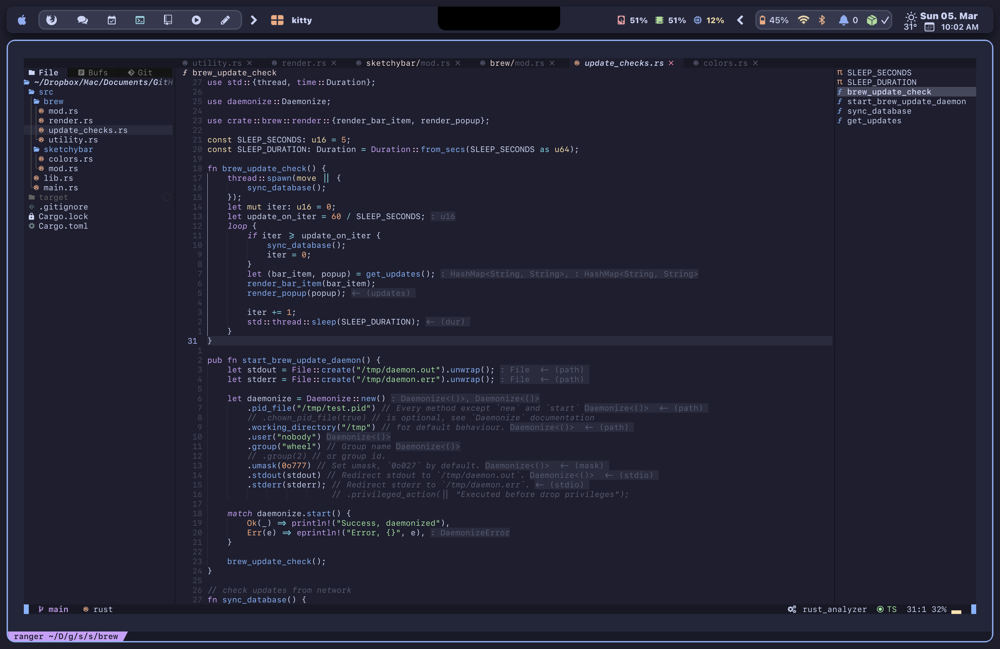
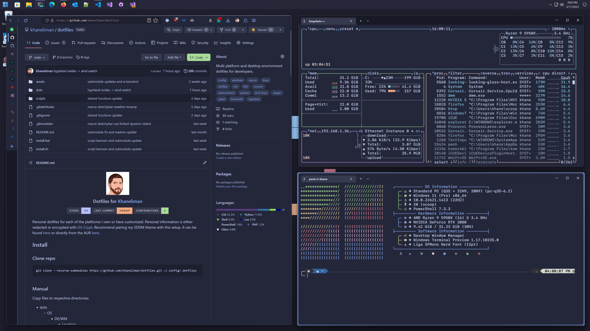
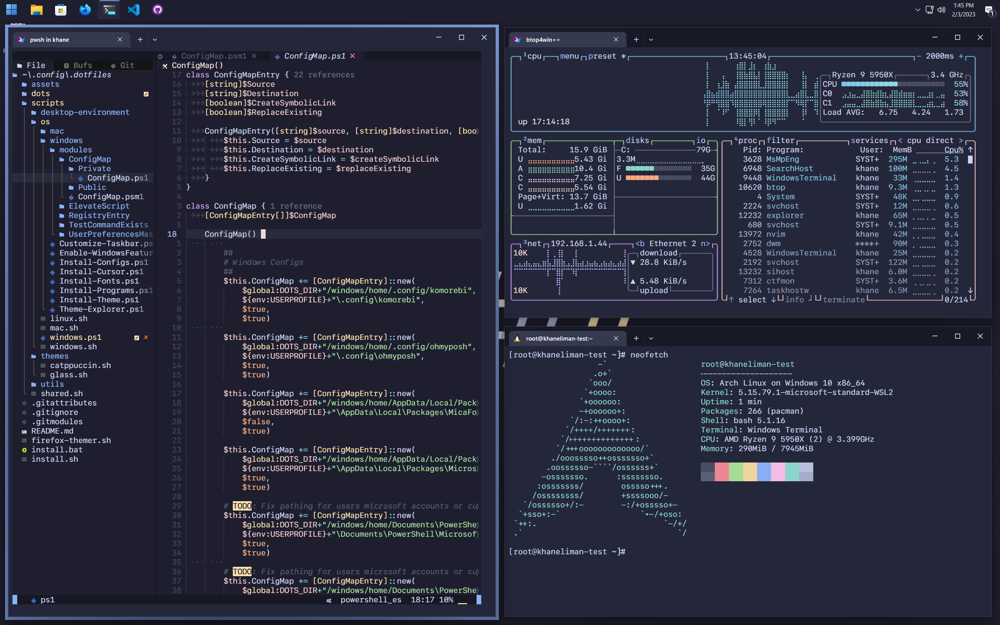

<h3 align="center">
 <br/>
 
 Dotfiles for <a href="https://github.com/khaneliman">Khaneliman</a>
 
</h3>

<p align="center">
 <a href="https://github.com/khaneliman/dotfiles/stargazers"></a>
 <a href="https://github.com/khaneliman/dotfiles/commits"></a>
 <a href="https://github.com/khaneliman/dotfiles/contributors"></a>
</p>

Personal dotfiles for each of the platforms I own or have customized. Personal information is either redacted or encrypted with [Git-Crypt](https://github.com/AGWA/git-crypt). Recommend pairing my SDDM theme with this setup. It can be found [here](https://github.com/khaneliman/sddm-catppuccin) or directly from the AUR [here](https://aur.archlinux.org/packages/sddm-catppuccin-git).

## Install

### Clone repo

    git clone --recurse-submodules https://github.com/khaneliman/dotfiles.git ~/.config/.dotfiles

### Manual

Copy files to respective directories:

- dots
  - OS
    - DE/WM
      - Location

Each environment might require further steps that will be detailed in their respective section.

### Automatic

```bash
./install.sh # for Linux and macOS
./install.bat # for windows
```

The script will detect what OS you are running the script from and perform the installation for that OS. You will need to select what environment you would like to install the dots for if there are multiple for that given OS.

## Linux

[](https://github.com/khaneliman/dotfiles/blob/main/dots/linux/)
[](https://github.com/khaneliman/dotfiles/blob/main/dots/linux/)

There are numerous Linux configs. My primary desktop usage is done through Arch Linux so I will update these most often.

### Awesome

[](https://github.com/khaneliman/dotfiles/blob/main/dots/linux/awesome/README.md)

This configuration is a glass effect [AwesomeWM](https://github.com/awesomeWM/awesome) with [Picom](https://github.com/yshui/picom) configuration. No utilities used for deployment, just basic dots. One of my first ricing attempts utilizing the glorious dotfiles as a base.

_Dotfiles might be out of sync with where they were in an optimized state since I rearranged dotfiles and switched most of my setups to using a catppuccin theme._


### Hyprland

[![Hyprland](https://img.shields.io/badge/Hyprland-24273a?logo=data:image/png;base64,iVBORw0KGgoAAAANSUhEUgAAAFwAAAB5CAYAAAC0jkbdAAAR0klEQVR42u2dd3hUVfrHv+dOb8kkSCghhQgkArIUAYGlSwuIDR6CjwguEErYoMhCNPID4REICAqsuyACi2UNYgEUxQaCKEuRZqHt0kvok0yv5/fHJGTKbZNe7vvP3JzM3Jn53Pd+3/c958w5QA03xcB+o8Q+15D7PIVk5bDmSVBsyxcNUbHzIxo9cvi5mvyVmJr84ZRLFlAoleJfQAnMuVnJMOgl4JFa9NRM6urUAYhQJHxxDaHNy6US8EgsIR5FUycCIJG9jgIAge3xQVAN6ZcpARdpqtcWUKrRROzdgdA9r764BjqtBFxQSqZkUme3rqWwKSkTdG+zJtAunUMl4HyWlISiyZOK/yCRezhFwGv80qJ5dMAiCTibEQLl4oWlUlIsDWU4UZC0uF6dmYMogwQ81KKmZVFXxw7BoIM8NhLYpa/3No6DZvlcKgEPtNatUZSZGazXZdFuBFygAMT29H6IGf80lYADgFwOxWsLKeSKUtAUZfNwGpypBB4XzpgINGooAdfnvkLdqWnhQfIetEhz8UA5Kj32xRihXJNHQUj9BU56/DnGMjKDxStJmCxEBpuwXgBXl/aI+tsUWj+BG2PAzF94x+/ZLEGyzNARnlYGtBVNHgP86YH6B1y9+HXqjWvMD6ps9w2/nqvVkK/Oo9VVhVYL8OhJWdTRvWdIkCTB+fc9DSaReTfbXRJyx3iSmkG7rHpSxaoH3jIVheMn8wRJsLSL/DKmIpa7hF1abMMHIObZkbRuA9frIX/jnxQqNXuQDDr2g9K+++4+sad3zl1IiMPBfvFYUkXTK9lA6v11F7hmXh71xCdyB8mQ/Ft18CAKP/6ku+g3OHUGuk1buANwiLRQvR7y1YsjG+SoLcCNz06g9n6DhYNksfcxpkI4c3MjTpoteW8SxckzLHJCWKtQT+r90C19hdYt4K3/BNOUF0UGSX+bYdnSfbh0KfL3stngnp4TLC28sYLAOnIYjFVU+lc+cL0BssUrKZQqkUGSQHXoAAo/+bh7md8zVFrALy0AQWHuNKBVSuUXe5V7dgL1qo3U0fXPpVU6KSZAaOm73zumYIpM8D2WTnD7VrnfXrHjU+pOa3Hv3OHvF/ze8vOX4Bn4NIHFWjs93JCdQx1deoK1u5W1k4rAsHzJvoqADQDu6bMJcThZpIX9vT3JCVC/nUdrpaQwPfp2NGdM5Ez32KRF++U2FH5aDilhkZaoFWu4JYxFzx19uiNqVhatXZISnwRmwzbqi44Ou21LOwBpkMTIbhbA+/hAAputwj+OKn8DdT7ciUdOQqTO54Vs7Ixe3u9//LHmA1epIX/vK+pJTAmDyqXhxGkHnfQMwfGjleNW9zWA7ItN1Ns4jvvCh7QRiwW0/yiCS9dqtqRo5yyjnmYpnOleUBdqMXv9R++h0mADwK3bYP5vUUaQjFB+aaF6PRTrllGoVTUXePRfsqmt76Oc6R5b0aP6ZT/Mb+RV+qiA+5vvN+k35keUKrofTINmxXxaM4G3bIPCMdN5Pbk0YPr/J7tRAOe8nCobgrHkvUmUR38T6OAKdgz78AGIeS6jwqBXzJc1GCH719fU26ip6CAJAmDq03oc3GdFVVpiPJht+dRnjOb+XIHHoIDTCQwbS/D76Zrh4eq5f6feuHhOT2brGdRv3ogqhw0AF6/AmLfSFYm0QK2CfO3SChm0KDdw45gs6ujchzsYsfQMqg7vh2XJvGobzb3z4WbVPT3n7OAK/tye5gnQLil/J1f5gKekwTRmBq8nhwZJ2Y0COOfPqt6h80A9F6pCA9psTw4u96BF2b+4RgvZO99Rb3wSb44dqOfE5QCdlkHw2xHUCAvNzwM/P4eeE7sddMBogrMXq9bD9ZPnUG/TZE5PZivfozasQI2BXZyfe6fMIKz9PKx6DlCtBqpyTJ0rE3B5t0eGWIY+G1GQ1H67BYUb/0FQ0+zIcUTnrRRIFYPbnF07ICpnGq0aSdEZIFu/h3rvaywirfL/T3niKFzZGQR2K2qqad9cTG2Pp4uWFrhdwKBnCE7+t3I9XDdtAfU2aCI6SDKFJrjmTqvRsAHA9vJ8/9CcKGkhgFIJ5RvzKBim8oCTjr2SrP0zONM9tuEz5dLZs3H1Amq82WxwZ2b7h+YEpcV/7GrfGlEzJtHKAa7Wgnlh2fkgFRIIkob8f8Lxw5dLUFvs4hXIs3MyxHZwgQLmqWOAlKSKB24YN5t64xJFB0nF2RMwb3iToJaZ+5udmzQ7vmevQmm4tFCNGqqFObRigSe0gDl9nOhKkikywf3y+Bqv21xmn5FbPNWCCOs5BZy9uyJ65KPnKgy4aloehVIj3PdQ/AGN6xYC1y6g1lrxVItIqlBLztRkaNTlB67ukT7L2a4X+5gky0Cw5qevcGfrBwS13UrGQ0WOhXqbNIJBRADlB0MIFP/YQ91JaaK6W2W3r8I7rmetlRLWuzt/PXU+/JCosVBisYJ2G05w+27ZPNz4xETqTnyA46qGS0v0B8tRl2ADgHPuIpGpIgHV66B7OZuWTVLkSpgfm8YTMIKlRX1wJ+5se5+grtmpM9BvzBctLdYR6UBSfOTAjU9Oot4G8QKTIf1tjPkuHEum1z3YxWZetFx8FapQQjtzKo0MOMPAPPA50ZMhDZ+8Bdy9ibps7pdeJfxJQ+kFsA17hPMniqzAY4aOpd64ZG69Dsi/5VfPovDfqwjquh05Ds2OnTxOGHCsUkL/QiYVDdwycDxrfs3WSeVdOSsZ9cTsrywImAbNLy3Wp9KBKL0wcPJgj0buxDaskx1DtVv9y07QI3su1BfguHUbYsdCqVaL6AnPUEHg6qETC3g7bAJuIcc78wnqmZlXrCaMqVDUWKj1icECHq7Rw9F+AE/pXnoy9eHvgfN/oN6ZzQbdps+4a5OANk9KEtChLTdw45CxlKp0gvOoQQHHe0sJ6qmZV6wmxO4M67Rjc1Lt2FGUE7jtoaGiEnzl6cPAqV9Qb81mg3brlxzjAcFO6nikJyCTsQCPaQRXq27hqQ7LVVNseesd1HOzvr6S8MW3kjZfTDTUg/rOCgNu7DeKgjDBJ2C5arLb12Dds3VifQeOW7eh/mEv/8IMxcfMoL55YcAdaT3CixuWAQfN/i8gmd+03+x0sXV1hB47u3YIlxRniy78S9cVt1l2fkwk1H67s3W7itgdYBvrDHRSb7MmQGLTAOAp7UH1DcI1KERa5NfOAqcOSaQDgqd6908sY52hlSeBcfAAeg949EOPUFY5Cblq6qPfSZBDTLPnZ1d4n0p45els36bUw13J7UXNq7P9/FWahDhUVr5Qcc5iCLgA7gfTSoG741sjeLQtvEwlLgd8x3efkhCHy4ry6K8BMsyuEp7EBECrAQO5Ep64FJYcMvhFigu/S3A5THHqDO80Cr/HMkCbVDBIeABgZOG3QcgJ5NfPSWS5gF+4xKkMgW3G9u0oE9uqA2XNvUOerLwoeTiXmf5zgAhOiwPgSYgH441uBP4Mxf9oOrZXyr+57OixcDlhkRZvwwZgPLHN2BfyCpWWwlsSWB4r7SMH54C7t2kTMD51FEcaGCIt189LVHlMVnADQgPuPp0OjC+qIXuwDMxQJP0WDpynz3Av51p87G0QA8an0rNPOAdPm2QsJtRrCFCdzp+H81eYRIIuxigEeg0JIFeACR70IeVfbFfycu5fZROmmDZrhSnBLpuX8094ZUCpYNCUwJcBPJu0+CgYeFwsO4qE6rlU84iDzLcIJgCXG4zMfIul2JGCZbk8m0MdmDsmMIz5JjvkgEd3s7YSTAFzt0zlzvaKucpu3wEjv3Wev8IsscQ2ElUe8yQmCi6CKb98FYz81gVR6U3sAw9JAsNlCQmgKrVgaS+/dAXMneN7CGveHfLoTOksgeWwmD79aDhgltL+jxPrGNy6BKboBn+FSYmk4zzmatlKxIQgwHbg4AQGAJTnDvFXTgBcKZ2B6DiJLos5evTkz78pILtyDbhW4K80VWf3c5f0AY+xD6dLOh5q8QnwxjXmz78BqI4dK640ARTu3Uy4Ny0qvVq2jsMlwCFmGDWacgXJwPRQvnffvnvAceMc5AWnQjw6vMR3pvaSZCXE7P0GCubfcLtRtGNH91LgANQnvuMv4SlAlRpEDZ4gyUqJdX5Y5UlIEsy/VUeOABYLgoBbdr1HOKdKBLRbe42TQJc46XMTHeFBMlxaNDt3lZb3944uHIPi4lGWYBmyaoIxHsZhUyQvb9EKju69eXdqASUgFgtMmzeTcOAAdPs/CC/pWVJFS//J9Z63ZurzVMyCD9pvvwWsVrACN+1YS5iiG+CXFsAT1wJRo16uv17euZvO3mcQd5AsOfb6YF37dpD3Bv9s0OOA9sCHHHl4sLRY+k8BoupnxqKYOcfCFyTvbW12YD9wPniKYNgPYy1bXifEYRaUFp+uAdRZa+qdlxum51B3izThTaAohfOtlWEAw39rb74J/Y/vcPapBJ7U0XYgYgeNqz/QW6TCMvJZUftbqPf9BBw5zNNZEpTv6MHk/Up9xiYBz2JbdgggbhvorM4EN+r47FqtFvL3t1NPQrLgKtLwuIGMxwj+ewbCHg4ADguivlkWcsuw94JRhRaKmfkUal3dzkrmLaeeZsmi9rfQbd8KNtjcwAGYvnyLKM8d5L8Zit/MHd8Wmqy1dVZaojJfoPbeg/mX7i5Zs/H2LViXce/awr3mFaVwrR5P4LKL0HMCe8fHoM1eV+egR4+dQouee1700t3q5YvWociEyIEDQMFpv7RQiEoVbV0z6hT06LFTaeGkHFZPZluVVLPza9i2b50A3rJRyAiBKmcHdab1FgygJX9r/5MP28rxpHbDzqKFmbNFbG3mf5QVXIY3I52UdFKVHTgAGBpCNv9n6o1NEAHd3646tQfOvBEEjtq3jqHupaXUOjRDcA+5kmPitIFmjib447jgucUt9mu+Ce/KDEKC9By8vYrO1F6QLT9Ca9X0itiGUL79ObWmjw7LxviW7jauyoMY2OKBA8C5XxCz6XnA5xPVwQUAXmM8yILdNCqj5ve7qPukz2I27qKutA6Ci9AHBklD/nrc3fSuaPmMWGeNQ6dR08jXWbZHZJeWknbF5d/gfjubwZkDNQt+kySoX3iNOrr0FbedWYC06LZ/BOuCyPYkKlNgi37qJVo4fK5oPQ9s1xzeCvvGXIIb56u5ktFB99f51Nb3CVC1WvQGIiXHml3bYc/NIv7Zx5UMHACMj2ZT01N5ACGsmUr4Bw6+AOpfv4br87938h3fdbhKQTdPg/bpbGrvMcQ/WypC0CCA7qvNsC54sUzsypW6xQzOpHdHLAWUKpFezi41muPfomjHelJpv5SLaQjjkAxq79QPznbd2J1BqH+k+DmGT9bDvLzs+8iVP1du3gnMjE+pL7pRRNLC5v2yu1ehPHsI6pN7cffEIYLTZVybJbk1Ytt2os5WHeFs2x2eps1F7M/DBxqA24HYVXNx57PyLUZfMcVJbFMosz+krpQu3NLCug+x8HMUl34Hcdkgv3425NwBuRoBvLFN4DPEwNMkGVSl4d5gmg8qh7TIrl+Gd84kgpPHyo2q4qpBRgbD6Fepuf9fAYWSswoV7/UiLxYXQEGoIrQbgPaHrbAtnU1gNVcIpoovv5PaQTFlA/WvwSISshjvF3x+BFBFBEnm7g2oVs1ZbN/1+UsViady+jsYGYzDsmjR4JnwGRryQxfj/ULSIBQERel18bHbAcO29TD/6w0Cm6XC0VRuB5MmCoYRs6ml90RQtb5cATUiaRGCyvZ6nwfa3Z/BtnYhwc1rlYakanr0dLGIGjaVWrs/A+99idUrLSFtxGqCbvensHy0mlTF3kNV24VKGBh7PnXO0S0j2dGmH+797LzM0gJxWzGGtfmgPHUQuh+34O4X7xM4HVWHoNpKa60RMb1HUGer7nCm9YLX2Dhyr49AWojVBNXJA1D//jNM331McLugWr52zRkkaNICMZ0HUldiO7ibpsLTKAU+fWyEXlwsE04r5NfPQXHlFBQX/0DhwV0E/zse0NNZfVazR2U0BqBpS6hiGmZqm92/hipUCPu1LgHg9cB78/IW8/WrT+Lq/ygsdxBpp1JV2f8DjjK3eV1xM+cAAAAASUVORK5CYII=&logoColor=00B8E9&style=for-the-badge)](https://github.com/khaneliman/dotfiles/blob/main/dots/linux/hyprland/README.md)

[Catppuccin](https://github.com/catppuccin/catppuccin) themed [Hyprland](https://github.com/hyprwm/Hyprland) configuration with a lot more time spent on it since it's my current daily driver. There are basic dotfiles and then some [aconfmgr](https://github.com/CyberShadow/aconfmgr) config thrown in for deploying a system. (WIP and not tested thoroughly)

#### Unique Install Steps

See the install steps in Hyrpland config's [README](/dots/linux/hyprland/README.md)

##### Standard Monitor




##### Ultrawide Monitor




### Gnome

[](https://github.com/khaneliman/dotfiles/blob/main/dots/linux/gnome/)

Dotfiles from my brief usage of Fedora with Gnome. Currently sparse and only contains the [dconf](https://github.com/GNOME/dconf) files that can be imported using dconf.

## MacOS

[](https://github.com/khaneliman/dotfiles/blob/main/dots/macos/)

I currently use [yabai](https://github.com/koekeishiya/yabai) with my daily driver MacBook Pro so this will contain the configuration used on my laptop.

### Yabai

[![Yabai](https://img.shields.io/badge/yabai-24273a?logoWidth=50&logo=data:image/svg+xml;base64,PHN2ZyB4bWxucz0iaHR0cDovL3d3dy53My5vcmcvMjAwMC9zdmciIHZpZXdCb3g9IjAgMCA4ODIgMjUwIj4KICA8c3R5bGU+CiAgICAuZ3JlZW4gewogICAgICBmaWxsOiM1YWJlNWM7CiAgICB9CiAgICAub3JhbmdlIHsKICAgICAgZmlsbDojZmVjNTQ3OwogICAgfQogICAgLnRleHQgewogICAgICBmaWxsOiMwMDM2NGI7CiAgICB9CiAgICAucmVkIHsKICAgICAgZmlsbDojZjM2ODY0OwogICAgfQogICAgQG1lZGlhIChwcmVmZXJzLWNvbG9yLXNjaGVtZTogZGFyaykgewogICAgICAudGV4dCB7CiAgICAgICAgZmlsbDogI2ViZWVlZjsKICAgICAgfQogICAgfQogIDwvc3R5bGU+CiAgPHRpdGxlPnlhYmFpIGxvZ28gYmFubmVyPC90aXRsZT4KICA8cGF0aCBjbGFzcz0iZ3JlZW4iIGQ9Ik0zMzYuNzQsNTkuODhhMTAuODQsMTAuODQsMCwwLDEsMTUuMzIsMGwyNC42NiwyNC42NkwzODUuMjksNzYsMzYwLjYyLDUxLjMyYTIyLjk0LDIyLjk0LDAsMCwwLTMyLjQ0LDBMMzAzLjcyLDc1Ljc3bDguNTYsOC41NloiLz4KICA8cGF0aCBjbGFzcz0ib3JhbmdlIiBkPSJNMjc1LjQzLDEzNi41MWExMC44MywxMC44MywwLDAsMSwwLTE1LjMyTDMwMCw5Ni42LDI5MS40Niw4OGwtMjQuNTksMjQuNmEyMi45NSwyMi45NSwwLDAsMCwwLDMyLjQ1bDI0LjU3LDI0LjU2TDMwMCwxNjEuMVoiLz4KICA8cGF0aCBjbGFzcz0idGV4dCIgZD0iTTQwMS40OSw3MmE4LjY3LDguNjcsMCwwLDAtMTIuMjYsMGwtNDQuNjIsNDQuNjNMMzAwLDcyYTguNjcsOC42NywwLDEsMC0xMi4yNiwxMi4yNmw0NC42MSw0NC42MkwyOTEsMTcwLjEybC0zLjY0LDMuNjJBOC42Nyw4LjY3LDAsMSwwLDI5OS41NiwxODZMNDAxLjQ5LDg0LjI5QTguNjgsOC42OCwwLDAsMCw0MDEuNDksNzJaIi8+CiAgPGNpcmNsZSBjbGFzcz0iZ3JlZW4iIGN4PSI1NTkuNjIiIGN5PSIxMjguOTIiIHI9IjkuMzQiLz4KICA8Y2lyY2xlIGNsYXNzPSJ0ZXh0IiBjeD0iNjEwLjgiIGN5PSI4MS44MiIgcj0iOS4zNCIvPgogIDxjaXJjbGUgY2xhc3M9Im9yYW5nZSIgY3g9IjQ4Ny42OSIgY3k9IjEyOC45MiIgcj0iMTAuMjEiLz4KICA8cGF0aCBjbGFzcz0idGV4dCIgZD0iTTQ4Ny42OSw5Ny4zM2EzMS41OSwzMS41OSwwLDEsMSwwLDYzLjE3LDMxLjMxLDMxLjMxLDAsMCwxLTE3LTUsNy41Miw3LjUyLDAsMCwxLTE0LjYtMi41NFY3OC4xNmE3LjU0LDcuNTQsMCwwLDEsMTUuMDcsMHYyMy44OUEzMS40MywzMS40MywwLDAsMSw0ODcuNjksOTcuMzNabTE2LjUxLDMxLjU5YTE2LjUxLDE2LjUxLDAsMSwwLTE2LjUxLDE2LjUxQTE2LjU0LDE2LjU0LDAsMCwwLDUwNC4yLDEyOC45MloiLz4KICA8cGF0aCBjbGFzcz0idGV4dCIgZD0iTTYxMC44LDE2MC41YTcuNTMsNy41MywwLDAsMS03LjUzLTcuNTNWMTA1YTcuNTQsNy41NCwwLDEsMSwxNS4wNywwdjQ4QTcuNTQsNy41NCwwLDAsMSw2MTAuOCwxNjAuNVoiLz4KICA8cGF0aCBjbGFzcz0icmVkIiBkPSJNNDEyLjE3LDExOC43QTEwLjIyLDEwLjIyLDAsMSwxLDQwMiwxMjguOTIsMTAuMjMsMTAuMjMsMCwwLDEsNDEyLjE3LDExOC43WiIvPgogIDxwYXRoIGNsYXNzPSJ0ZXh0IiBkPSJNNDM2LjIyLDk3LjQ4YTcuNTEsNy41MSwwLDAsMC03LDQuODlsLS41MS0uMzFoMGwtLjA2LDAtLjE5LS4xMmgwYTMxLjU3LDMxLjU3LDAsMSwwLC43Miw1My42QTcuNTIsNy41MiwwLDAsMCw0NDMuNzYsMTUzVjEwNUE3LjU1LDcuNTUsMCwwLDAsNDM2LjIyLDk3LjQ4Wm0tMjQuMDUsNDhhMTYuNTIsMTYuNTIsMCwxLDEsMTYuNTEtMTYuNTFBMTYuNTQsMTYuNTQsMCwwLDEsNDEyLjE3LDE0NS40M1oiLz4KICA8cGF0aCBjbGFzcz0idGV4dCIgZD0iTTU4My42Nyw5Ny40OGE3LjUzLDcuNTMsMCwwLDAtNyw0Ljg5bC0uNS0uMzFoMGwtLjA2LDAtLjE5LS4xMmgwYTMwLjQ2LDMwLjQ2LDAsMCwwLTIwLjI2LTQuMjksMzEuNTUsMzEuNTUsMCwwLDAsMCw2Mi41OSwzMC42OSwzMC42OSwwLDAsMCwyMS00LjdBNy41Miw3LjUyLDAsMCwwLDU5MS4yLDE1M1YxMDVBNy41NCw3LjU0LDAsMCwwLDU4My42Nyw5Ny40OFptLTI0LDQ4YTE2LjUyLDE2LjUyLDAsMSwxLDE2LjUxLTE2LjUxQTE2LjU0LDE2LjU0LDAsMCwxLDU1OS42MiwxNDUuNDNaIi8+CiAgPHBhdGggY2xhc3M9InJlZCIgZD0iTTM5Ny40LDg4LjM4bC04LjU3LDguNTUsNS43OCw1Ljc4YTMxLjMzLDMxLjMzLDAsMCwxLDEyLjIzLTQuODlaIi8+CiAgPHBhdGggY2xhc3M9InJlZCIgZD0iTTM1Mi4wNiwxOTguMTFhMTAuODQsMTAuODQsMCwwLDEtMTUuMzIsMGwtMjQuNjItMjQuNjItOC41Nyw4LjU2LDI0LjYzLDI0LjYyYTIyLjk0LDIyLjk0LDAsMCwwLDMyLjQ0LDBsNDYuNi00Ni42YTMxLjQzLDMxLjQzLDAsMCwxLTEyLjM1LTQuNzZaIi8+Cjwvc3ZnPgo=&style=for-the-badge)](https://github.com/khaneliman/dotfiles/blob/main/dots/macos/yabai/README.md)

#### Unique Install Steps

See the install steps in MacOS config's [README](/dots/macos/yabai/README.md)

Current window manager is used on my laptop. Uses [sketchybar](https://github.com/FelixKratz/SketchyBar) for UI and [skhd](https://github.com/koekeishiya/skhd) for keybinds.




## Windows

[](https://github.com/khaneliman/dotfiles/blob/main/dots/windows/)

### Komorebi

[](https://github.com/khaneliman/dotfiles/blob/main/dots/windows/komorebi/README.md)

#### Unique Install Steps

See the install steps in Windows config's [README](/dots/windows/komorebi/README.md)

Current window manager [Komorebi](https://github.com/LGUG2Z/komorebi) with [whkd](https://github.com/LGUG2Z/whkd) for key binds and configuring Komorebi.




## Shared

This contains all the platform agnostic and/or shared application configurations that will be the same between all platforms and desktop environments.

## Credits

Inspiration and code from numerous locations all over the internet. Here are some of the major contributors to my setups.

### Submodules

- Shared
  - [AstroNvim](https://astronvim.github.io/)
  - [AstroNvim User Config](https://github.com/khaneliman/astronvim.git)
- macOS
  - [crissNb Dynamic Island Sketchybar](https://github.com/crissNb/Dynamic-Island-Sketchybar)
  - [Sketchybar Helper](https://github.com/FelixKratz/SketchyBarHelper.git)
- AwesomeWM
  - [AwesomeWM Widgets](https://github.com/streetturtle/awesome-wm-widgets)
  - [Bling](https://github.com/BlingCorp/bling)
  - [Smart Borders](https://github.com/intrntbrn/smart_borders)
- Firefox
  - [BlurredFox](https://github.com/khaneliman/blurredfox)
- Ranger
  - [Disk Menu](https://github.com/SL-RU/ranger_udisk_menu)
  - [Dev Icons](https://github.com/alexanderjeurissen/ranger_devicons)

### Dotfiles / Documentation

- Shared dotfiles
  - [Catppuccin](https://github.com/catppuccin/catppuccin)
- Linux dotfiles
  - Awesome
    - [The Glorious Dotfiles](https://github.com/manilarome/the-glorious-dotfiles)
  - Hyprland
    - [sway-nvidia](https://github.com/crispyricepc/sway-nvidia)
    - [Hyprland](https://wiki.hyprland.org/)
- macOS dotfiles
  - Yabai
    - [FelixKratz dotfiles](https://github.com/FelixKratz/dotfiles)
