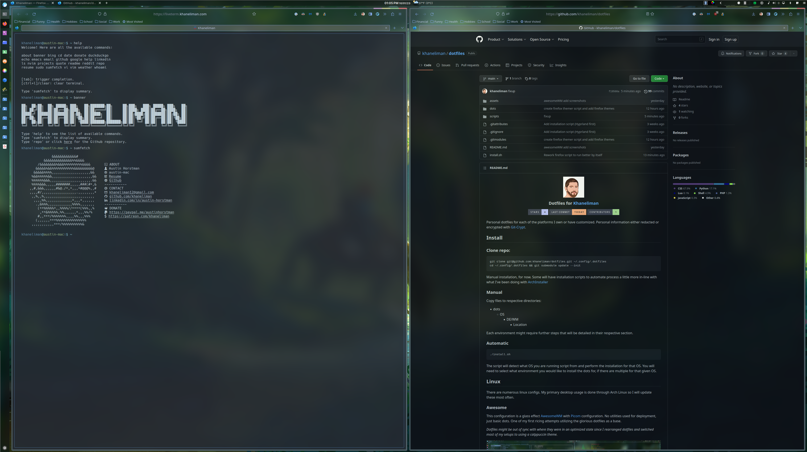
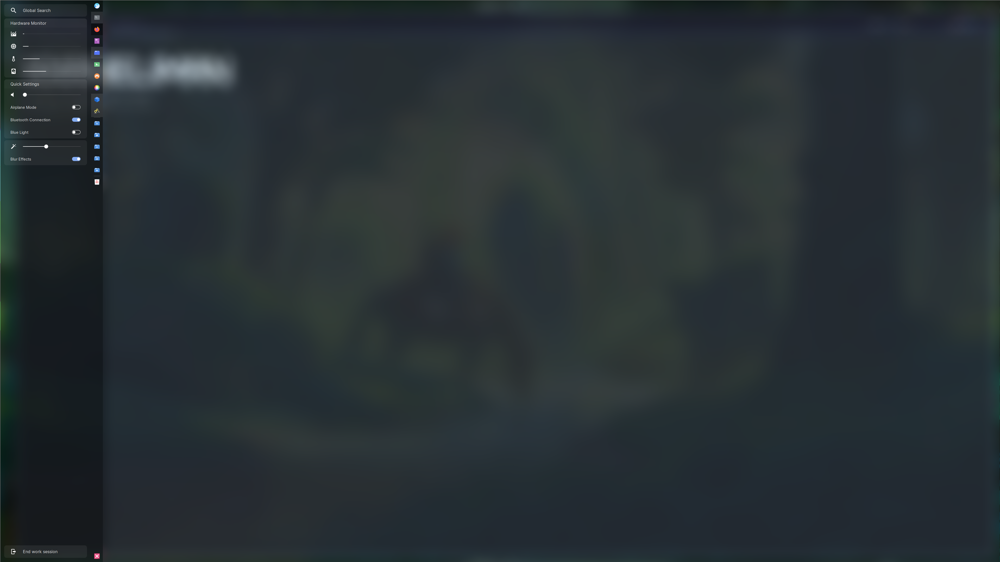
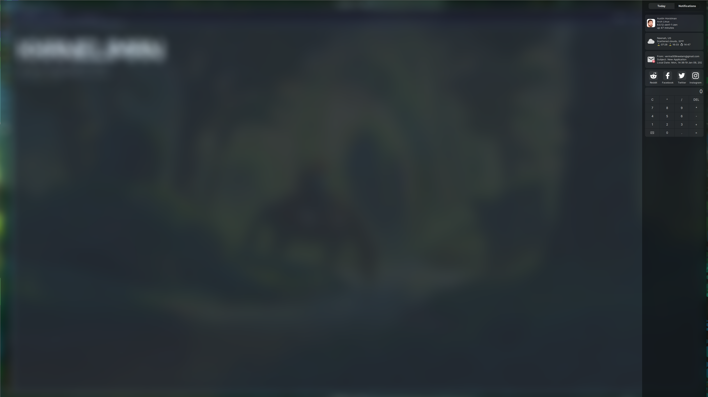

#### AwesomeWM

[AwesomeWM](https://awesomewm.org/) configuration based off [The Glorious Dotfiles](https://github.com/manilarome/the-glorious-dotfiles). Dotfiles might be out of sync with where they were in an optimized state since I rearranged dotfiles and switched most of my setups to using a catppuccin theme.

##### Unique Install Steps

## Screenshots

### Standard monitor

### Ultrawide monitor
