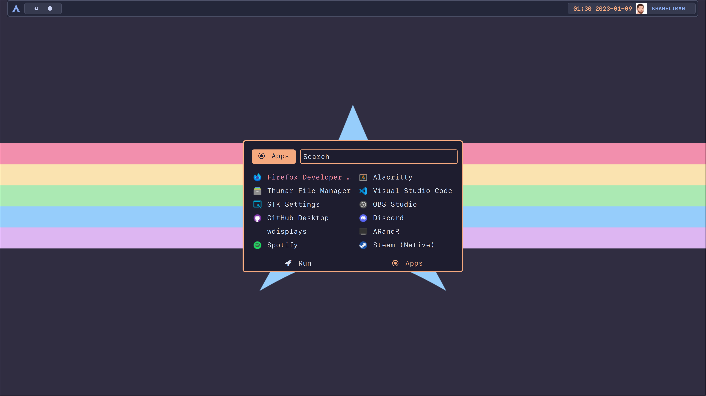
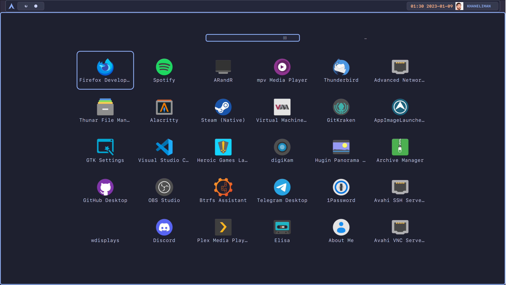
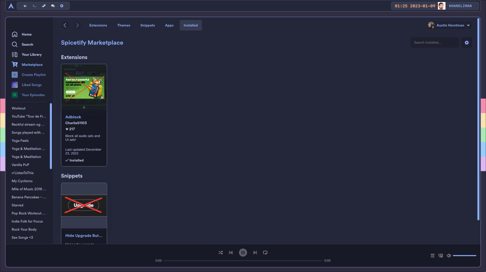
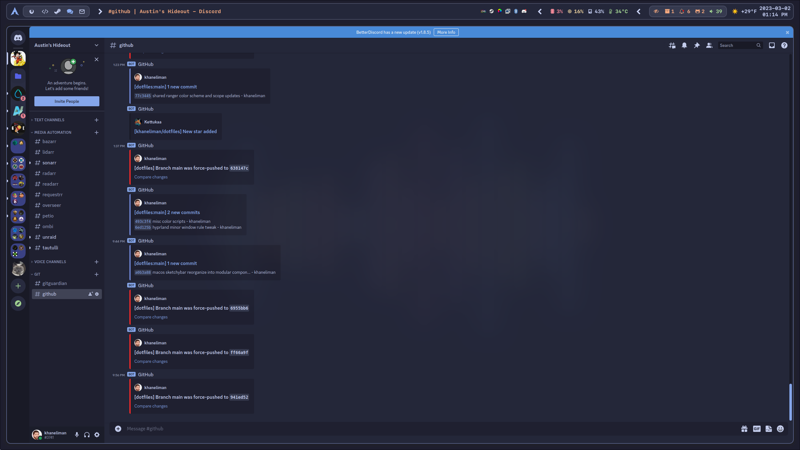
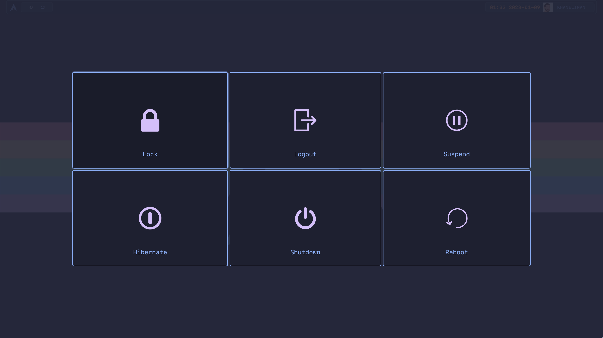

# Hyprland

[](https://github.com/khaneliman/dotfiles/blob/main/dots/linux/)
[](https://github.com/khaneliman/dotfiles/blob/main/dots/linux/)
[![Hyprland](https://img.shields.io/badge/Hyprland-24273a?logo=data:image/png;base64,iVBORw0KGgoAAAANSUhEUgAAAFwAAAB5CAYAAAC0jkbdAAAR0klEQVR42u2dd3hUVfrHv+dOb8kkSCghhQgkArIUAYGlSwuIDR6CjwguEErYoMhCNPID4REICAqsuyACi2UNYgEUxQaCKEuRZqHt0kvok0yv5/fHJGTKbZNe7vvP3JzM3Jn53Pd+3/c958w5QA03xcB+o8Q+15D7PIVk5bDmSVBsyxcNUbHzIxo9cvi5mvyVmJr84ZRLFlAoleJfQAnMuVnJMOgl4JFa9NRM6urUAYhQJHxxDaHNy6US8EgsIR5FUycCIJG9jgIAge3xQVAN6ZcpARdpqtcWUKrRROzdgdA9r764BjqtBFxQSqZkUme3rqWwKSkTdG+zJtAunUMl4HyWlISiyZOK/yCRezhFwGv80qJ5dMAiCTibEQLl4oWlUlIsDWU4UZC0uF6dmYMogwQ81KKmZVFXxw7BoIM8NhLYpa/3No6DZvlcKgEPtNatUZSZGazXZdFuBFygAMT29H6IGf80lYADgFwOxWsLKeSKUtAUZfNwGpypBB4XzpgINGooAdfnvkLdqWnhQfIetEhz8UA5Kj32xRihXJNHQUj9BU56/DnGMjKDxStJmCxEBpuwXgBXl/aI+tsUWj+BG2PAzF94x+/ZLEGyzNARnlYGtBVNHgP86YH6B1y9+HXqjWvMD6ps9w2/nqvVkK/Oo9VVhVYL8OhJWdTRvWdIkCTB+fc9DSaReTfbXRJyx3iSmkG7rHpSxaoH3jIVheMn8wRJsLSL/DKmIpa7hF1abMMHIObZkbRuA9frIX/jnxQqNXuQDDr2g9K+++4+sad3zl1IiMPBfvFYUkXTK9lA6v11F7hmXh71xCdyB8mQ/Ft18CAKP/6ku+g3OHUGuk1buANwiLRQvR7y1YsjG+SoLcCNz06g9n6DhYNksfcxpkI4c3MjTpoteW8SxckzLHJCWKtQT+r90C19hdYt4K3/BNOUF0UGSX+bYdnSfbh0KfL3stngnp4TLC28sYLAOnIYjFVU+lc+cL0BssUrKZQqkUGSQHXoAAo/+bh7md8zVFrALy0AQWHuNKBVSuUXe5V7dgL1qo3U0fXPpVU6KSZAaOm73zumYIpM8D2WTnD7VrnfXrHjU+pOa3Hv3OHvF/ze8vOX4Bn4NIHFWjs93JCdQx1deoK1u5W1k4rAsHzJvoqADQDu6bMJcThZpIX9vT3JCVC/nUdrpaQwPfp2NGdM5Ez32KRF++U2FH5aDilhkZaoFWu4JYxFzx19uiNqVhatXZISnwRmwzbqi44Ou21LOwBpkMTIbhbA+/hAAputwj+OKn8DdT7ciUdOQqTO54Vs7Ixe3u9//LHmA1epIX/vK+pJTAmDyqXhxGkHnfQMwfGjleNW9zWA7ItN1Ns4jvvCh7QRiwW0/yiCS9dqtqRo5yyjnmYpnOleUBdqMXv9R++h0mADwK3bYP5vUUaQjFB+aaF6PRTrllGoVTUXePRfsqmt76Oc6R5b0aP6ZT/Mb+RV+qiA+5vvN+k35keUKrofTINmxXxaM4G3bIPCMdN5Pbk0YPr/J7tRAOe8nCobgrHkvUmUR38T6OAKdgz78AGIeS6jwqBXzJc1GCH719fU26ip6CAJAmDq03oc3GdFVVpiPJht+dRnjOb+XIHHoIDTCQwbS/D76Zrh4eq5f6feuHhOT2brGdRv3ogqhw0AF6/AmLfSFYm0QK2CfO3SChm0KDdw45gs6ujchzsYsfQMqg7vh2XJvGobzb3z4WbVPT3n7OAK/tye5gnQLil/J1f5gKekwTRmBq8nhwZJ2Y0COOfPqt6h80A9F6pCA9psTw4u96BF2b+4RgvZO99Rb3wSb44dqOfE5QCdlkHw2xHUCAvNzwM/P4eeE7sddMBogrMXq9bD9ZPnUG/TZE5PZivfozasQI2BXZyfe6fMIKz9PKx6DlCtBqpyTJ0rE3B5t0eGWIY+G1GQ1H67BYUb/0FQ0+zIcUTnrRRIFYPbnF07ICpnGq0aSdEZIFu/h3rvaywirfL/T3niKFzZGQR2K2qqad9cTG2Pp4uWFrhdwKBnCE7+t3I9XDdtAfU2aCI6SDKFJrjmTqvRsAHA9vJ8/9CcKGkhgFIJ5RvzKBim8oCTjr2SrP0zONM9tuEz5dLZs3H1Amq82WxwZ2b7h+YEpcV/7GrfGlEzJtHKAa7Wgnlh2fkgFRIIkob8f8Lxw5dLUFvs4hXIs3MyxHZwgQLmqWOAlKSKB24YN5t64xJFB0nF2RMwb3iToJaZ+5udmzQ7vmevQmm4tFCNGqqFObRigSe0gDl9nOhKkikywf3y+Bqv21xmn5FbPNWCCOs5BZy9uyJ65KPnKgy4aloehVIj3PdQ/AGN6xYC1y6g1lrxVItIqlBLztRkaNTlB67ukT7L2a4X+5gky0Cw5qevcGfrBwS13UrGQ0WOhXqbNIJBRADlB0MIFP/YQ91JaaK6W2W3r8I7rmetlRLWuzt/PXU+/JCosVBisYJ2G05w+27ZPNz4xETqTnyA46qGS0v0B8tRl2ADgHPuIpGpIgHV66B7OZuWTVLkSpgfm8YTMIKlRX1wJ+5se5+grtmpM9BvzBctLdYR6UBSfOTAjU9Oot4G8QKTIf1tjPkuHEum1z3YxWZetFx8FapQQjtzKo0MOMPAPPA50ZMhDZ+8Bdy9ibps7pdeJfxJQ+kFsA17hPMniqzAY4aOpd64ZG69Dsi/5VfPovDfqwjquh05Ds2OnTxOGHCsUkL/QiYVDdwycDxrfs3WSeVdOSsZ9cTsrywImAbNLy3Wp9KBKL0wcPJgj0buxDaskx1DtVv9y07QI3su1BfguHUbYsdCqVaL6AnPUEHg6qETC3g7bAJuIcc78wnqmZlXrCaMqVDUWKj1icECHq7Rw9F+AE/pXnoy9eHvgfN/oN6ZzQbdps+4a5OANk9KEtChLTdw45CxlKp0gvOoQQHHe0sJ6qmZV6wmxO4M67Rjc1Lt2FGUE7jtoaGiEnzl6cPAqV9Qb81mg3brlxzjAcFO6nikJyCTsQCPaQRXq27hqQ7LVVNseesd1HOzvr6S8MW3kjZfTDTUg/rOCgNu7DeKgjDBJ2C5arLb12Dds3VifQeOW7eh/mEv/8IMxcfMoL55YcAdaT3CixuWAQfN/i8gmd+03+x0sXV1hB47u3YIlxRniy78S9cVt1l2fkwk1H67s3W7itgdYBvrDHRSb7MmQGLTAOAp7UH1DcI1KERa5NfOAqcOSaQDgqd6908sY52hlSeBcfAAeg949EOPUFY5Cblq6qPfSZBDTLPnZ1d4n0p45els36bUw13J7UXNq7P9/FWahDhUVr5Qcc5iCLgA7gfTSoG741sjeLQtvEwlLgd8x3efkhCHy4ry6K8BMsyuEp7EBECrAQO5Ep64FJYcMvhFigu/S3A5THHqDO80Cr/HMkCbVDBIeABgZOG3QcgJ5NfPSWS5gF+4xKkMgW3G9u0oE9uqA2XNvUOerLwoeTiXmf5zgAhOiwPgSYgH441uBP4Mxf9oOrZXyr+57OixcDlhkRZvwwZgPLHN2BfyCpWWwlsSWB4r7SMH54C7t2kTMD51FEcaGCIt189LVHlMVnADQgPuPp0OjC+qIXuwDMxQJP0WDpynz3Av51p87G0QA8an0rNPOAdPm2QsJtRrCFCdzp+H81eYRIIuxigEeg0JIFeACR70IeVfbFfycu5fZROmmDZrhSnBLpuX8094ZUCpYNCUwJcBPJu0+CgYeFwsO4qE6rlU84iDzLcIJgCXG4zMfIul2JGCZbk8m0MdmDsmMIz5JjvkgEd3s7YSTAFzt0zlzvaKucpu3wEjv3Wev8IsscQ2ElUe8yQmCi6CKb98FYz81gVR6U3sAw9JAsNlCQmgKrVgaS+/dAXMneN7CGveHfLoTOksgeWwmD79aDhgltL+jxPrGNy6BKboBn+FSYmk4zzmatlKxIQgwHbg4AQGAJTnDvFXTgBcKZ2B6DiJLos5evTkz78pILtyDbhW4K80VWf3c5f0AY+xD6dLOh5q8QnwxjXmz78BqI4dK640ARTu3Uy4Ny0qvVq2jsMlwCFmGDWacgXJwPRQvnffvnvAceMc5AWnQjw6vMR3pvaSZCXE7P0GCubfcLtRtGNH91LgANQnvuMv4SlAlRpEDZ4gyUqJdX5Y5UlIEsy/VUeOABYLgoBbdr1HOKdKBLRbe42TQJc46XMTHeFBMlxaNDt3lZb3944uHIPi4lGWYBmyaoIxHsZhUyQvb9EKju69eXdqASUgFgtMmzeTcOAAdPs/CC/pWVJFS//J9Z63ZurzVMyCD9pvvwWsVrACN+1YS5iiG+CXFsAT1wJRo16uv17euZvO3mcQd5AsOfb6YF37dpD3Bv9s0OOA9sCHHHl4sLRY+k8BoupnxqKYOcfCFyTvbW12YD9wPniKYNgPYy1bXifEYRaUFp+uAdRZa+qdlxum51B3izThTaAohfOtlWEAw39rb74J/Y/vcPapBJ7U0XYgYgeNqz/QW6TCMvJZUftbqPf9BBw5zNNZEpTv6MHk/Up9xiYBz2JbdgggbhvorM4EN+r47FqtFvL3t1NPQrLgKtLwuIGMxwj+ewbCHg4ADguivlkWcsuw94JRhRaKmfkUal3dzkrmLaeeZsmi9rfQbd8KNtjcwAGYvnyLKM8d5L8Zit/MHd8Wmqy1dVZaojJfoPbeg/mX7i5Zs/H2LViXce/awr3mFaVwrR5P4LKL0HMCe8fHoM1eV+egR4+dQouee1700t3q5YvWociEyIEDQMFpv7RQiEoVbV0z6hT06LFTaeGkHFZPZluVVLPza9i2b50A3rJRyAiBKmcHdab1FgygJX9r/5MP28rxpHbDzqKFmbNFbG3mf5QVXIY3I52UdFKVHTgAGBpCNv9n6o1NEAHd3646tQfOvBEEjtq3jqHupaXUOjRDcA+5kmPitIFmjib447jgucUt9mu+Ce/KDEKC9By8vYrO1F6QLT9Ca9X0itiGUL79ObWmjw7LxviW7jauyoMY2OKBA8C5XxCz6XnA5xPVwQUAXmM8yILdNCqj5ve7qPukz2I27qKutA6Ci9AHBklD/nrc3fSuaPmMWGeNQ6dR08jXWbZHZJeWknbF5d/gfjubwZkDNQt+kySoX3iNOrr0FbedWYC06LZ/BOuCyPYkKlNgi37qJVo4fK5oPQ9s1xzeCvvGXIIb56u5ktFB99f51Nb3CVC1WvQGIiXHml3bYc/NIv7Zx5UMHACMj2ZT01N5ACGsmUr4Bw6+AOpfv4br87938h3fdbhKQTdPg/bpbGrvMcQ/WypC0CCA7qvNsC54sUzsypW6xQzOpHdHLAWUKpFezi41muPfomjHelJpv5SLaQjjkAxq79QPznbd2J1BqH+k+DmGT9bDvLzs+8iVP1du3gnMjE+pL7pRRNLC5v2yu1ehPHsI6pN7cffEIYLTZVybJbk1Ytt2os5WHeFs2x2eps1F7M/DBxqA24HYVXNx57PyLUZfMcVJbFMosz+krpQu3NLCug+x8HMUl34Hcdkgv3425NwBuRoBvLFN4DPEwNMkGVSl4d5gmg8qh7TIrl+Gd84kgpPHyo2q4qpBRgbD6Fepuf9fAYWSswoV7/UiLxYXQEGoIrQbgPaHrbAtnU1gNVcIpoovv5PaQTFlA/WvwSISshjvF3x+BFBFBEnm7g2oVs1ZbN/1+UsViady+jsYGYzDsmjR4JnwGRryQxfj/ULSIBQERel18bHbAcO29TD/6w0Cm6XC0VRuB5MmCoYRs6ml90RQtb5cATUiaRGCyvZ6nwfa3Z/BtnYhwc1rlYakanr0dLGIGjaVWrs/A+99idUrLSFtxGqCbvensHy0mlTF3kNV24VKGBh7PnXO0S0j2dGmH+797LzM0gJxWzGGtfmgPHUQuh+34O4X7xM4HVWHoNpKa60RMb1HUGer7nCm9YLX2Dhyr49AWojVBNXJA1D//jNM331McLugWr52zRkkaNICMZ0HUldiO7ibpsLTKAU+fWyEXlwsE04r5NfPQXHlFBQX/0DhwV0E/zse0NNZfVazR2U0BqBpS6hiGmZqm92/hipUCPu1LgHg9cB78/IW8/WrT+Lq/ygsdxBpp1JV2f8DjjK3eV1xM+cAAAAASUVORK5CYII=&logoColor=00B8E9&style=for-the-badge)](https://github.com/khaneliman/dotfiles/blob/main/dots/linux/hyprland/README.md)

[Catppuccin](https://github.com/catppuccin/catppuccin)-themed [Hyprland](https://github.com/hyprwm/Hyprland) configuration with a lot more time spent on it since it's my current daily driver. There are basic dotfiles and then some [aconfmgr](https://github.com/CyberShadow/aconfmgr) config thrown in for deploying a system. (WIP and not tested thoroughly)

## Unique Install Steps

- Create system links from ~/.local files to their /usr/local paths
- Create a system link from ~/.config/waybar to /usr/local/share/waybar if you want automatic reload to work

  ```bash
  sudo ln -s ~/.local/share/wlroots-env/ /usr/local/share/
  sudo ln -s ~/.config/waybar/ /usr/local/share/waybar
  sudo ln -s ~/.local/bin/Hyprland-custom /usr/local/bin/
  sudo ln -s ~/.local/bin/xdg-desktop-portal.sh /usr/local/bin/
  sudo ln -s ~/.local/bin/hyprland_setup_dual_monitors.sh /usr/local/bin
  sudo ln -s ~/.local/bin/hyprland_cleanup_after_startup.s /usr/local/binh
  sudo ln -s ~/.local/bin/hyprland_handle_monitor_connect.sh /usr/local/bin
  ```

- Enable user systemd services so the applications auto start properly (or add exec-once statements to ~/.config/hypr/hyprland.conf if you dont use systemd)

  ```bash
  systemctl --user enable --now hypr-waybar.service
  systemctl --user enable --now waybar-config.path
  systemctl --user enable --now hypr-swayidle.service
  systemctl --user enable --now hyprpaper.service
  systemctl --user enable --now hyprland-desktop-portal.service
  ```

- Copy the dots/linux/hyprland/usr/share/wayland-sessions/hyprland-custom.desktop to /usr/share/wayland-sessions/

## Screenshots

### Standard monitor









### Ultrawide monitor


