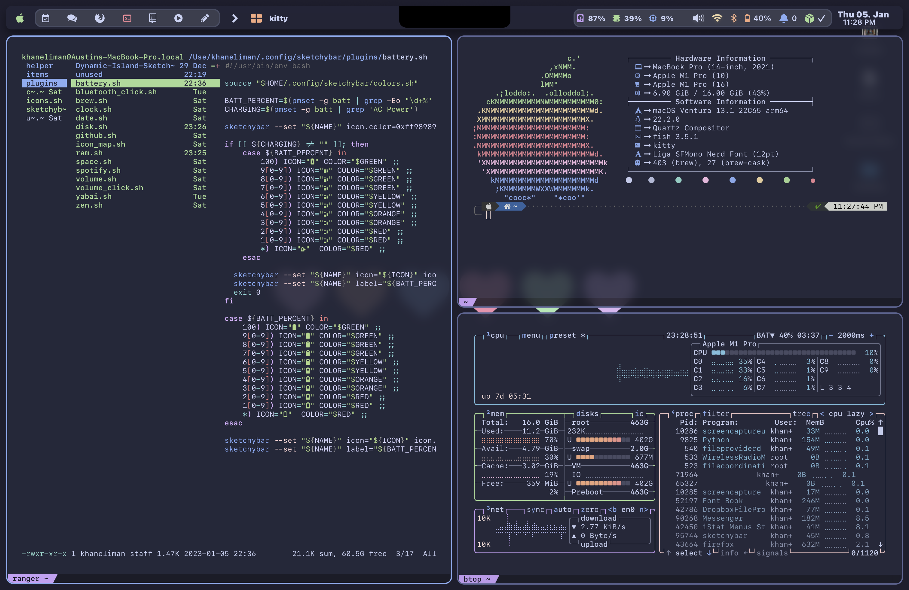
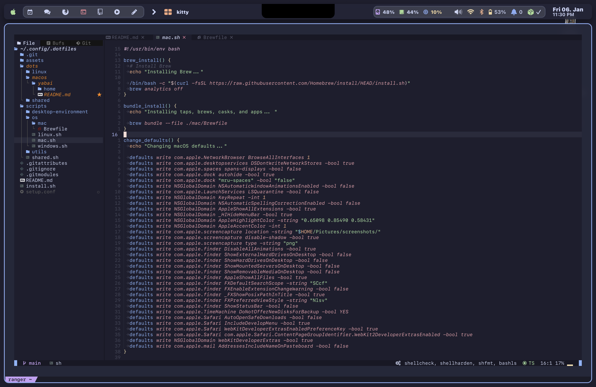

# Yabai

[Catppuccin](https://github.com/catppuccin/catppuccin) themed [Yabai](https://github.com/koekeishiya/yabai) configuration.
There's basic configuration of sketchybar, yabai, and skhd with application theming and configuration that's cross platform coming from the shared folder.

## Unique Install Steps

- Fonts need to be copied/moved to the ~/Library/Fonts/ since macOS doesn't read from the ~/.fonts/ directory.

```bash
 sudo mv ~/.fonts/* ~/Library/Fonts/
```

- Lots of dependencies on applications installed through Brew so you need to install it

```bash
/bin/bash -c "$(curl -fsSL <https://raw.githubusercontent.com/Homebrew/install/HEAD/install.sh>)"

```

- Bundle file contains a list of the brew casks, taps, and brews. Check file and remove anything you think you dont need and install :

```bash
 brew bundle --file ./mac/Brewfile
```

- Enable and start primary applications for theme

```bash
 brew services start skhd
 brew services start yabai
 brew services start sketchybar
```

## Screenshots



