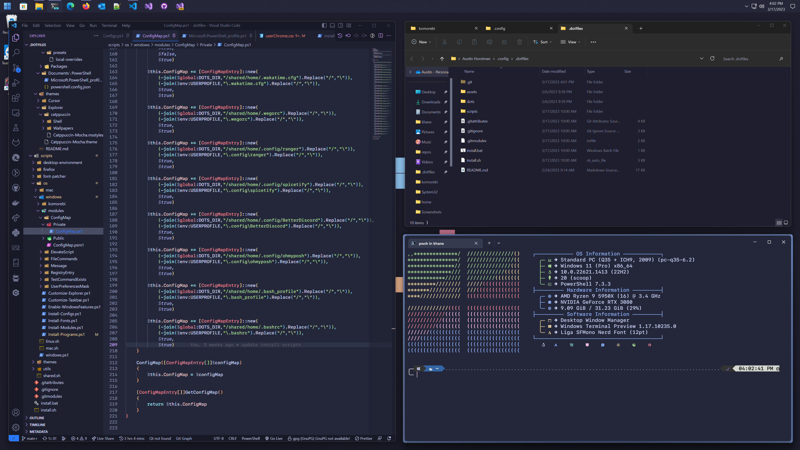

# Komorebi

[](https://github.com/khaneliman/dotfiles/blob/main/dots/windows/)
[](https://github.com/khaneliman/dotfiles/blob/main/dots/windows/komorebi/README.md)

[Catppuccin](https://github.com/catppuccin/catppuccin)-themed [Komorebi](https://github.com/LGUG2Z/komorebi) configuration.
There's the configuration of Windows Explorer, theme, cursors, fonts, a tiling window manager, and hotkey daemon with application theming and configuration that's cross-platform coming from the shared folder.
Windows doesn't abide by most nix standards and requires a lot of manual workarounds that differ from Linux and MacOS. Much of the software I use is also not easily available on Windows and must be run through
WSL. The automatic installation handles almost everything for you, but some stuff must be done manually, like patching windows for unsigned themes.

## Unique Install Steps

- Windows git requires a git config update to properly clone this repo

        git config --global core.longpaths true

- Fonts need to be copied/moved to the C:\Users\$username\AppData\Local\Microsoft\Windows\Fonts since Windows doesn't read from the ~/.fonts/ directory.

- Lots of dependencies on applications installed through Winget and Scoop so you need to install them (Need the latest winget version to support skipping existing installs)

```powershell
irm get.scoop.sh | iex

$download_url = "https://github.com/microsoft/winget-cli/releases/download/v1.4.10173/Microsoft.DesktopAppInstaller_8wekyb3d8bbwe.msixbundle"
$download_save_file = "$($env:USERPROFILE)\Downloads\MicrosoftDesktopAppInstaller_8wekyb3d8bbwe.msixbundle"
$wc.Downloadfile($download_url, $download_save_file)
Add-AppXPackage -Path $($env:USERPROFILE)\Downloads\MicrosoftDesktopAppInstaller_8wekyb3d8bbwe.msixbundle
```

- Unsigned applications require developer mode to be enabled

```powershell
 $RegistryKeyPath = "HKLM:\SOFTWARE\Microsoft\Windows\CurrentVersion\AppModelUnlock"

 if (! (Test-Path -Path $RegistryKeyPath))
 {
     New-Item -Path $RegistryKeyPath -ItemType Directory -Force
 }

 if (! (Get-ItemProperty -Path $RegistryKeyPath | Select -ExpandProperty AllowDevelopmentWithoutDevLicense))
 {
     # Add registry value to enable Developer Mode
     New-ItemProperty -Path $RegistryKeyPath -Name AllowDevelopmentWithoutDevLicense -PropertyType DWORD -Value 1
 }
```

- If you would like to use WSL, you need to enable a few features like WSL, Virtual Machine Platform, and Hyper-V

```powershell
 $feature = Get-WindowsOptionalFeature -FeatureName Microsoft-Windows-Subsystem-Linux -Online
 if ($feature -and ($feature.State -eq "Disabled"))
 {
     Enable-WindowsOptionalFeature -FeatureName Microsoft-Windows-Subsystem-Linux -Online -All -LimitAccess -NoRestart
 }

 $feature = Get-WindowsOptionalFeature -FeatureName VirtualMachinePlatform -Online
 if ($feature -and ($feature.State -eq "Disabled"))
 {
     Enable-WindowsOptionalFeature -FeatureName VirtualMachinePlatform -Online -All -LimitAccess -NoRestart
 }

 $feature = Get-WindowsOptionalFeature -FeatureName Microsoft-Hyper-V -Online
 if ($feature -and ($feature.State -eq "Disabled"))
 {
     Enable-WindowsOptionalFeature -FeatureName Microsoft-Hyper-V -Online -All -LimitAccess -NoRestart
 }
```

- Install Win 11 Theme Patcher

```powershell
$postParams = @{Uxtheme='UltraUXThemePatcher';id='Uxtheme'}
$ProgressPreference = 'SilentlyContinue'
Invoke-WebRequest -Uri https://mhoefs.eu/software_count.php -OutFile "$($env:USERPROFILE)\Downloads\UltraUXThemePatcher.exe" -Method POST -Body $postParams
```

- Install windows theme files to C:\Windows\Resources\Themes

- Install Cursor file install.inf and select cursor.

- Set the color theme to manual and custom value #ff4e3430

- Set tiling window manager to launch with windows

```powershell
## Set komorebi to run on startup
$RegPath = "HKCU:\Software\Microsoft\Windows\CurrentVersion\Run"
Set-RegistryEntry -Key 'KomorebicOnLogin' -Type "SZ" -Value 'C:\Program Files\komorebi\bin\komorebic.exe start --await-configuration' -Path $RegPath

$RegPath = "HKCU:\Software\Microsoft\Windows\CurrentVersion\Run"
Set-RegistryEntry -Key 'KomorebicConfigOnLogin' -Type "SZ" -Value "$($env:USERPROFILE)\.config\komorebi\komorebi.ahk" -Path $RegPath
```

- Programs used in config. I prefer to use a winget version, when available, for a regular installation. Scoop is user-level by design so it's easier to install but unusual in management.

```powershell
$winget_apps = @(
        'MSYS2.MSYS2',
        'JanDeDobbeleer.OhMyPosh',
        'Microsoft.Powershell.Preview',
        'Microsoft.WindowsTerminalPreview',
        'Bitsum.ProcessLasso',
        'Git.Git',
        'GitHub.GitHubDesktop',
        'Microsoft.VisualStudioCode',
        'Neovim.Neovim',
        'Microsoft.DotNet.SDK.7',
        'Microsoft.DotNet.Runtime.7',
        'Mozilla.Firefox.DeveloperEdition',
        'AgileBits.1Password',
        'Microsoft.Teams',
        'MicaForEveryone.MicaForEveryone',
        'Rainmeter.Rainmeter',
        'AntibodySoftware.WizTree',
        'Notepad++.Notepad++',
        'Microsoft.Sysinternals.Autoruns',
        'Valve.Steam',
        'HeroicGamesLauncher.HeroicGamesLauncher',
        'StartIsBack.StartAllBack',
        'LGUG2Z.komorebi',
        'AutoHotkey.AutoHotkey',
        'Lexikos.AutoHotkey',
        'Alacritty.Alacritty'
    )

 $scoop_apps = @(
        'sudo', 'bat', 'btop', 'fastfetch', 'pshazz', 'git-crypt', 'vcredist', '1password-cli',
        'secureuxtheme', '7tsp', 'archwsl', 'spicetify-cli', 'topgrade'
    )

```

## Screenshots




